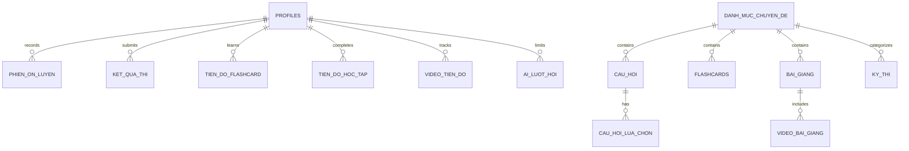
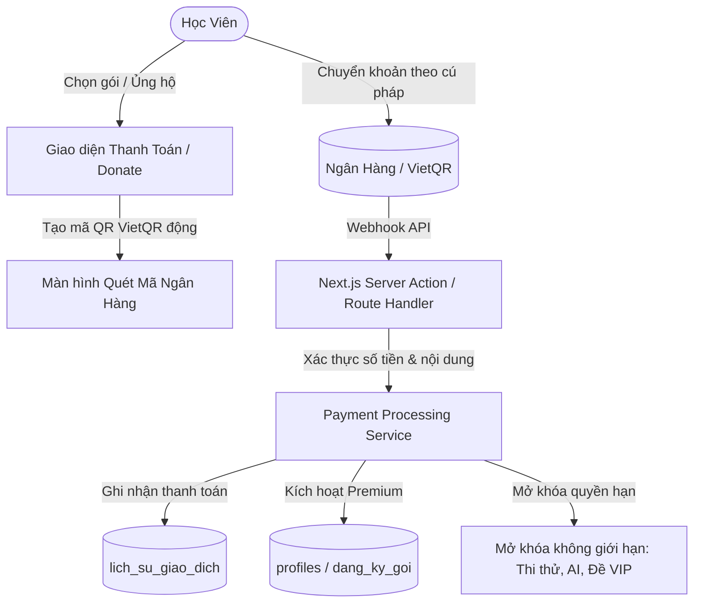

# BẢN THIẾT KẾ HỆ THỐNG CHI TIẾT (SYSTEM ARCHITECTURE & DESIGN SPECIFICATION)
## DỰ ÁN: NỀN TẢNG ÔN LUYỆN THI CHỨNG CHỈ NGHIỆP VỤ HẢI QUAN
**Mã dự án:** `web-on-luyen-hai-quan`  
**Phiên bản tài liệu:** 2.0 (Master Blueprint)  
**Tiêu chuẩn kiến trúc:** Serverless Cloud-Native, Edge Computing, Mobile-First PWA, RLS Data Security.

---

## 1. TỔNG QUAN DỰ ÁN & MỤC TIÊU HỆ THỐNG

### 1.1. Mục tiêu và Sứ mệnh
Xây dựng một nền tảng EdTech chuyên sâu, hiệu năng cao phục vụ người học ôn thi Chứng chỉ Nghiệp vụ Khai Hải quan (Tổng cục Hải quan). Hệ thống cung cấp giải pháp toàn diện từ học lý thuyết, xem video, tra cứu văn bản pháp luật, luyện trắc nghiệm, thi thử bấm giờ, ghi nhớ nhanh bằng Flashcard Spaced Repetition cho tới Huấn luyện viên cá nhân hóa (AI Coach) và Trợ lý giải đáp học tập (AI Assistant).

### 1.2. Các Nguyên Tắc Thiết Kế Cốt Lõi (Core Principles)
1. **Tối ưu chi phí vận hành (Zero / Low Operating Cost)**: Khai thác tối đa kiến trúc Serverless (Cloudflare Workers, Supabase Free/Pro Tier, Cloudflare R2, Workers AI) đảm bảo hệ thống chịu tải lớn với chi phí tối thiểu.
2. **Bảo mật dữ liệu & Bản quyền nội dung (Content Security)**: Tài liệu PDF và đề thi được bảo vệ, chặn tải trực tiếp trên trình duyệt/mobile; bảo vệ Database đa tầng qua Supabase RLS (Row Level Security).
3. **Trải nghiệm di động vượt trội (Mobile-First PWA)**: Giao diện mượt mà, cài đặt như ứng dụng gốc (App Icon HD, Splash Screen, Standalone Display).
4. **Thiết kế thẩm mỹ chuẩn ngành (Domain Branding)**: Màu chủ đạo **Xanh rêu Hải quan (`#1B4D3E`)** và **Vàng kim (`#C9A227`)**, font chữ hiện đại **Plus Jakarta Sans**, bố cục thẻ Card bóng bẩy (Glassmorphism & Micro-animations).

---

## 2. KIẾN TRÚC HẠ TẦNG & CÔNG NGHỆ (TECH STACK & INFRASTRUCTURE)

```
                       ┌──────────────────────────────────────────────┐
                       │          Client (Web & Mobile PWA)           │
                       │   Next.js 15, Tailwind v4, Plus Jakarta Sans │
                       └──────────────────────┬───────────────────────┘
                                              │ HTTPS / JSON / Presigned URL
                                              ▼
                       ┌──────────────────────────────────────────────┐
                       │     Cloudflare Workers Edge Network          │
                       │     OpenNext Runtime (@opennextjs)           │
                       └───────┬──────────────┬───────────────┬───────┘
                               │              │               │
            ┌──────────────────┴──┐    ┌──────┴──────┐   ┌────┴─────────────────┐
            │   Cloudflare R2     │    │ Workers AI  │   │  Supabase (Postgres) │
            │   Private Bucket    │    │ Llama 3.3   │   │  Auth SSR & RLS      │
            │  (tai-lieu-hoc-tap) │    │  70B FP8    │   │  Aggregate Queries   │
            └─────────────────────┘    └─────────────┘   └──────────────────────┘
```

### 2.1. Chi tiết Ngăn xếp Công nghệ (Tech Stack)
- **Frontend / Fullstack Framework**: Next.js 15 (App Router, React 19, Server Components & Server Actions).
- **Edge Deployment & Hosting**: Cloudflare Workers qua `@opennextjs/cloudflare` và `wrangler`.
- **Database & Authentication**: Supabase (PostgreSQL 15+, `@supabase/ssr`, Supabase Auth).
- **Object Storage**: Cloudflare R2 (`@aws-sdk/client-s3`, private bucket, S3 presigned URL).
- **Trí tuệ nhân tạo (AI)**: Cloudflare Workers AI Binding (`@cf/meta/llama-3.3-70b-instruct-fp8-fast`).
- **PWA Engine**: `@ducanh2912/next-pwa`, Service Worker, Workbox, Web App Manifest.
- **Trình đọc PDF**: `react-pdf` (render dạng Canvas chống tải lậu file gốc).

---

## 3. THIẾT KẾ CƠ SỞ DỮ LIỆU (DATABASE SCHEMA SPECIFICATION)

Toàn bộ bảng sử dụng khóa chính dạng UUID `gen_random_uuid()` và kích hoạt RLS.



### 3.1. Danh mục các Bảng dữ liệu chính

1. **`profiles`**: Thông tin người dùng đồng bộ từ `auth.users`.
   - `id` (UUID, PK), `email`, `ho_ten`, `so_dien_thoai`, `vai_tro` (`admin` | `hoc_vien`), `is_premium` (boolean), `ngay_tao`.

2. **`danh_muc_chuyen_de`**: 4 Chuyên đề cốt lõi của kỳ thi Hải quan.
   - `id` (UUID, PK), `ma_chuyen_de`, `ten`, `slug`, `mo_ta`, `thu_tu`, `trang_thai`.

3. **`cau_hoi` & `cau_hoi_lua_chon`**: Ngân hàng câu hỏi trắc nghiệm & 4 đáp án.
   - `cau_hoi`: `id`, `chuyen_de_id`, `noi_dung`, `giai_thich`, `do_kho` (`de`|`trung_binh`|`kho`), `ngay_tao`.
   - `cau_hoi_lua_chon`: `id`, `cau_hoi_id`, `ky_hieu` (A, B, C, D), `noi_dung`, `la_dap_an_dung` (boolean).

4. **`phien_on_luyen`**: Lưu lịch sử ôn luyện tự do (Lưu tổng hợp để tối ưu dung lượng DB).
   - `id`, `hoc_vien_id`, `chuyen_de_id`, `tong_so_cau`, `so_cau_dung`, `thoi_gian_lam_giay`, `ngay_tao`.

5. **`ky_thi` & `ket_qua_thi`**: Quản lý kỳ thi thật và các bài thi thử.
   - `ky_thi`: `id`, `tieu_de`, `chuyen_de_id`, `thoi_gian_lam_phut`, `so_cau_hoi`, `ds_cau_hoi_id` (UUID[]), `trang_thai`.
   - `ket_qua_thi`: `id`, `hoc_vien_id`, `ky_thi_id`, `chuyen_de_id`, `loai_bai` (`thi_thu`|`ky_thi_that`), `diem_so` (số câu đúng thực tế), `so_cau_dung`, `tong_so_cau`, `thoi_gian_lam_giay`, `chi_tiet_bai_lam` (JSONB), `ngay_thi`.

6. **`flashcards` & `tien_do_flashcard`**: Hệ thống thẻ ghi nhớ Spaced Repetition.
   - `flashcards`: `id`, `chuyen_de_id`, `mat_truoc`, `mat_sau`, `ngay_tao`.
   - `tien_do_flashcard`: `id`, `hoc_vien_id`, `flashcard_id`, `hop_so` (1-5), `lan_lap_lai`, `ngay_on_tiep_theo`, `ngay_on_cuoi`.

7. **`bai_giang`, `video_bai_giang`, `tien_do_hoc_tap`, `video_tien_do`**: Quản lý học liệu lý thuyết & video.
   - `bai_giang`: `id`, `chuyen_de_id`, `tieu_de`, `slug`, `noi_dung_markdown`, `thu_tu`.
   - `video_bai_giang`: `id`, `bai_giang_id`, `tieu_de`, `youtube_video_id`, `thoi_luong_giay`.
   - `tien_do_hoc_tap`: `id`, `hoc_vien_id`, `bai_giang_id`, `hoan_thanh`, `ngay_hoan_thanh`.
   - `video_tien_do`: `id`, `hoc_vien_id`, `video_id`, `thoi_gian_da_xem_giay`, `hoan_thanh`.

8. **`van_ban_phap_luat`**: Hệ thống tra cứu văn bản quy phạm pháp luật.
   - `id`, `so_hieu`, `ten_van_ban`, `loai_van_ban`, `co_quan_ban_hanh`, `ngay_ban_hanh`, `ngay_hieu_luc`, `file_url` (R2 Storage Key).

9. **`ai_luot_hoi`**: Quản lý hạn ngạch hỏi Trợ lý AI hàng ngày.
   - `id`, `hoc_vien_id`, `ngay` (Date: YYYY-MM-DD), `so_luot_da_dung`.

---

## 4. QUY TẮC NGHIỆP VỤ & RÀNG BUỘC (BUSINESS RULES & LIMITS)

### 4.1. Phân quyền & Điều hướng
- Sau khi đăng nhập thành công $\rightarrow$ Luôn điều hướng về Trang chủ `/` (không điều hướng vào `/profile`).
- Chỉ tài khoản có `vai_tro = 'admin'` mới được truy cập các đường dẫn `/admin/*`.

### 4.2. Quota & Giới hạn Tài khoản Miễn phí (Free Tier Limits)
- **Thi thử (`thi_thu`)**: Tối đa **2 lần / ngày**. Kiểm tra theo mốc `00:00:00` giờ Việt Nam (UTC+7).
- **Trợ lý AI (`ai_luot_hoi`)**: Tối đa **10 lượt hỏi / ngày**. Không lưu lại nội dung đoạn chat vào database để đảm bảo quyền riêng tư và tiết kiệm DB.
- **Tài khoản Admin / Premium**: Không bị giới hạn các quota trên.

### 4.3. Quy tắc Chấm điểm Tuyệt đối (Absolute Exam Scoring Rule)
- Chấm điểm dựa trên phép so sánh `lua_chon_da_chon === dap_an_dung`.
- **Câu chưa trả lời (bỏ trống hoặc hết giờ)**: Luôn bị tính là **SAI**. Tuyệt đối không tính điểm dựa trên phép trừ `tổng số câu - số câu sai`.
- `diem_so` trong DB lưu số câu đúng thô. Quy đổi thang 10: `(so_cau_dung / tong_so_cau) * 10`.

### 4.4. Bảo vệ Tài liệu PDF trên Thiết bị Di động
- Tuyệt đối không dùng thẻ `<iframe src="pdf...">` trực tiếp (vì sẽ lộ nút tải/chia sẻ gốc của trình duyệt).
- Bắt buộc dùng component `PDFViewer` (render PDF sang HTML Canvas bằng `react-pdf`) kèm phân trang tùy biến để chống tải file trực tiếp.

---

## 5. THIẾT KẾ CÁC TÍNH NĂNG AI (AI SPECIFICATIONS)

### 5.1. Trợ lý AI Học Viên (AI Study Assistant)
- **Runtime**: Cloudflare Workers AI (`env.AI.run`).
- **Mô hình**: `@cf/meta/llama-3.3-70b-instruct-fp8-fast`.
- **System Prompt Ràng buộc**:
  - Đóng vai trò Giảng viên/Trợ giảng Pháp luật Hải quan Việt Nam.
  - Tuyệt đối trung thực, chỉ trả lời dựa trên ngữ cảnh pháp lý và kiến thức chuyên ngành.
  - Khi học viên hỏi đáp án câu trắc nghiệm: **Không đưa ra đáp án trực tiếp**, chỉ gợi ý nguyên lý, điều luật liên quan để học viên tự tư duy.

### 5.2. AI Coach — Huấn Luyện Viên Cá Nhân Hóa (AI Coach)
- **Service Layer (`layThongKeCaNhan`)**: Tính toán độc lập các tỷ lệ:
  - Tỷ lệ làm đúng ôn luyện (%) theo chuyên đề.
  - Điểm trung bình thi thử theo chuyên đề.
  - Tỷ lệ hoàn thành học liệu (%) theo chuyên đề.
  - Đánh giá xu hướng 7 ngày (Tiến bộ / Cần cải thiện / Ổn định).
- **Nguyên tắc riêng tư**: Chỉ gửi dữ liệu thống kê số liệu phần trăm cho AI, tuyệt đối **không gửi nội dung câu hỏi/đáp án**.
- **Cơ chế Tiết kiệm Quota (Client-side Caching)**:
  - Nút bấm thủ công "Xem nhận xét từ AI Coach" (không tự gọi khi load trang).
  - Tự động lưu cache tại `localStorage` (`ai_coach_feedback_[userId]`) trong ngày (`YYYY-MM-DD`). Học viên vào lại trong ngày sẽ đọc từ cache, tiết kiệm 100% quota Workers AI.

---

## 6. THIẾT KẾ GIAO DIỆN & PWA (UI/UX & PWA DESIGN TOKENS)

### 6.1. Bảng màu Nhận diện (Design Tokens)
- **Primary Color**: `#1B4D3E` (Xanh rêu Hải quan Việt Nam).
- **Primary Dark**: `#103025` / `#0B231B`.
- **Accent Color**: `#C9A227` (Vàng kim hoàng gia / Phù hiệu).
- **Backgrounds**: Slate/Emerald-50 nhẹ nhàng cho dashboard (`#F8F9FA` $\rightarrow$ `#F0FDF4`).
- **Typography**: `Plus Jakarta Sans` (Google Fonts), hỗ trợ tiếng Việt sắc nét.

### 6.2. Tiêu chuẩn Biểu tượng Di động (Mobile App Icon Standard)
- Bộ icon squircle 3D kim loại vàng chữ "HQ" sắc nét:
  - `public/icons/icon-512x512.png` (Android High-Res).
  - `public/icons/icon-192x192.png` (Android Standard).
  - `public/icons/icon-maskable-512x512.png` (Android Adaptive Maskable).
  - `public/icons/apple-touch-icon.png` (iOS Safari Home Screen 180x180).
  - `public/favicon.png` & `src/app/favicon.ico`.

---

## 7. NGUYÊN TẮC BUILD & TRIỂN KHAI (BUILD & DEPLOYMENT PROTOCOL)

1. **Git Remote**: Remote chính để push code là `web` (không dùng `origin`). Lệnh chuẩn: `git push web main`.
2. **TypeScript Strictness**:
   - Khi truyền biểu thức động vào boolean prop (như `disabled`), bắt buộc bọc `Boolean(...)` hoặc `!!(...)` để tránh lỗi `null is not assignable to boolean` khi Vercel/Cloudflare build.
3. **Biến Môi Trường trên Cloudflare Workers**:
   - Để tránh Next.js Webpack thay thế tĩnh `process.env.VAR` thành `undefined`, luôn gán:
     ```typescript
     const env = process.env;
     const myVar = env['VAR_NAME'];
     ```
   - Biến môi trường thường phải khai báo trong `wrangler.toml` tại khối `[vars]`.
   - Khóa bí mật (Secrets) bắt buộc set qua CLI: `npx wrangler secret put TÊN_SECRET`.
4. **Đảm bảo Lockfile Deterministic (`npm ci`)**:
   - Luôn test `npm run build` cục bộ trước khi push. Không tùy tiện thêm thư viện native gây lệch OS lockfile giữa Windows và Linux runtime.

---

## 8. KẾ HOẠCH MỞ RỘNG GIAI ĐOẠN TIẾP THEO (PHASE 2: DONATE & THU PHÍ THUÊ BAO)

*Phần này đóng vai trò là kim chỉ nam kiến trúc khi bắt đầu Phase 2.*



### 8.1. Phân hệ 1: Tính năng Donate (Ủng hộ phát triển)
- **Mục đích**: Cho phép học viên tự nguyện ủng hộ kinh phí duy trì máy chủ và đội ngũ biên soạn.
- **Cơ chế hoạt động**:
  - Giao diện Popup / Trang `/donate`: Tạo mã VietQR động với số tiền tùy chọn (vd: 20k, 50k, 100k, 200k) và cú pháp nội dung: `DONATE [USER_ID] [HO_TEN]`.
  - Tự động nhận diện thanh toán qua Webhook ngân hàng (Casso / SeAPay / VietQR Webhook).
  - Ghi nhận vào bảng `lich_su_donate`.
  - Hiển thị Bảng Vinh Danh Người Ủng Hộ (Top Donators) trên Trang chủ / Trang Giới thiệu để tăng tính cộng đồng.

### 8.2. Phân hệ 2: Tính năng Đóng Phí Thuê Bao (Subscription / Membership)
- **Mục đích**: Chuyển đổi mô hình Freemium sang Premium có thu phí để vận hành bền vững.
- **Thiết kế Bảng dữ liệu bổ sung**:
  1. **`goi_dich_vu`**:
     - `id` (UUID, PK), `ma_goi` (`1_thang`, `3_thang`, `tron_goi`), `ten_goi`, `gia_tien`, `thoi_han_ngay`, `quyen_loi` (JSONB), `trang_thai`.
  2. **`dang_ky_dich_vu`**:
     - `id` (UUID, PK), `hoc_vien_id` (FK `profiles.id`), `goi_id` (FK `goi_dich_vu.id`), `ngay_bat_dau`, `ngay_het_han`, `tong_tien`, `trang_thai` (`cho_thanh_toan` | `kich_hoat` | `het_han` | `huy`).
  3. **`lich_su_giao_dich`**:
     - `id`, `hoc_vien_id`, `ma_giao_dich_ngan_hang`, `so_tien`, `noi_dung_chuyen_khoan`, `cong_thanh_toan`, `ngay_tao`.

- **Đặc quyền Mở khóa cho Tài khoản Premium**:
  - 🔓 **Không giới hạn lượt thi thử**: Vượt qua giới hạn 2 lần/ngày.
  - 🔓 **Không giới hạn Trợ lý AI**: Vượt qua giới hạn 10 lượt hỏi/ngày.
  - 🔓 **Truy cập Kho đề thi VIP độc quyền**: Bộ đề dự đoán sát đề thi thật từ ban chuyên môn.
  - 🔓 **Tải trọn bộ Bộ thẻ ghi nhớ Flashcard nâng cao** và tài liệu tóm tắt kiến thức sơ đồ tư duy.
  - 🔓 **Huy hiệu VIP / Premium** sáng bóng trên hồ sơ cá nhân.

- **Quy trình Kích hoạt & Phê duyệt**:
  1. **Tự động 100%**: Webhook ngân hàng kiểm tra đúng `so_tien` và `ma_giao_dich` $\rightarrow$ Tự động cập nhật `profiles.is_premium = true` và gia hạn `ngay_het_han`.
  2. **Duyệt thủ công (Fallback)**: Trang Admin `/admin/thanh-toan` cho phép quản trị viên tra soát và bấm "Kích hoạt gói thủ công" khi học viên chuyển khoản sai cú pháp.

---
*Tài liệu này là chuẩn mực thiết kế kỹ thuật cao nhất của hệ thống, được lưu trữ vĩnh viễn trong mã nguồn để phục vụ bảo trì và phát triển các giai đoạn tiếp theo.*
